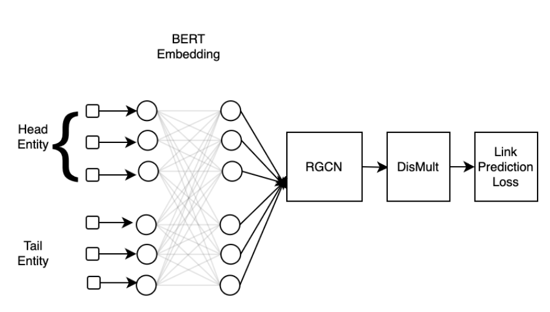

# Investigating Knowlege Graph  Completion with Pre-trained Language model and Graph Neural Networks

A repository containing the implementation of Bert embeddings with RGCN for the link prediction task in knowledge graph

**Abstract** 

In recent years, two lines of research in deep learning are very gaining interest namely large language models and Graph Neural Networks. The earlier one has shown reasonable performance in different types of NLP tasks and capturing the structural relationship with the graph convolution operation is the key reason behind the success of GNNs. Predicting links in knowledge graphs is a very important task for knowledge completion and information retrieval. Considering the knowledge graph have text data in their entities and relations and also provides the structural information in the form of a triplet, several state-of-the-art approaches have separately employed BERT-like large language models and GNNs to predict links knowledge graph. In this study, we aim at investigating how the combination of embeddings from the large language models followed by a graph convolution network can solve the link prediction task. We performed experiments on three real-world knowledge graph datasets and demonstrated our results.
